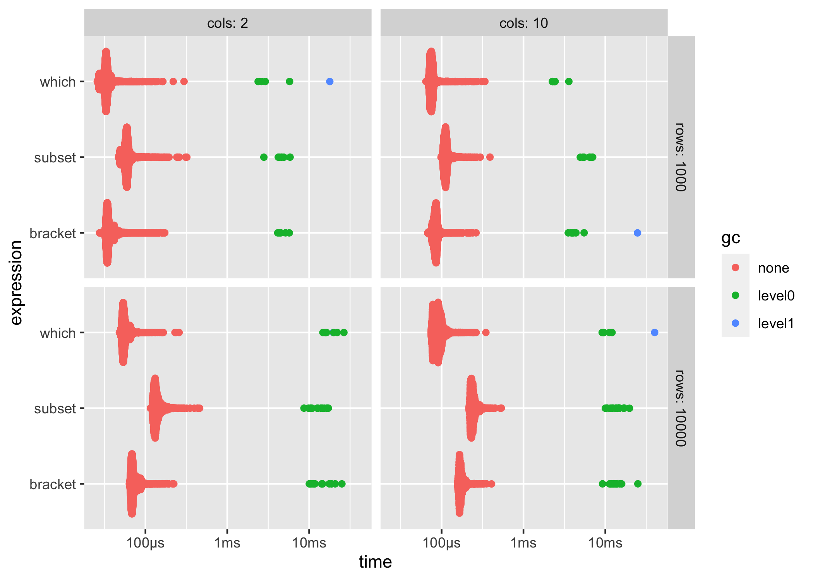
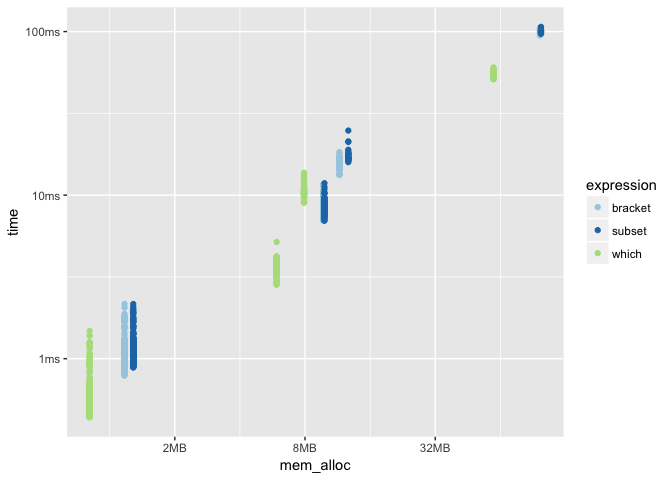

<!-- README.md is generated from README.Rmd. Please edit that file -->

# bench

[](https://cran.r-project.org/package=bench)
[](https://travis-ci.org/r-lib/bench)
[](https://ci.appveyor.com/project/r-lib/bench)
[](https://codecov.io/github/r-lib/bench?branch=master)

The goal of bench is to benchmark code, tracking execution time, memory
allocations and garbage collections.

## Installation

You can install the development version from
[GitHub](https://github.com/) with:

``` r
# install.packages("devtools")
devtools::install_github("r-lib/bench")
```

## Features

`bench::mark()` is used to benchmark one or a series of expressions, we
feel it has a number of advantages over [alternatives](#alternatives).

  - Always uses the highest precision APIs available for each operating
    system (often nanoseconds).
  - Tracks memory allocations for each expression.
  - Tracks the number and type of R garbage collections per expression
    iteration.
  - Verifies equality of expression results by default, to avoid
    accidentally benchmarking inequivalent code.
  - Has `bench::press()`, which allows you to easily perform and combine
    benchmarks across a large grid of values.
  - Uses adaptive stopping by default, running each expression for a set
    amount of time rather than for a specific number of iterations.
  - Expressions are run in batches and summary statistics are calculated
    after filtering out iterations with garbage collections. This allows
    you to isolate the performance and effects of garbage collection on
    running time (for more details see [Neal
    2014](https://radfordneal.wordpress.com/2014/02/02/inaccurate-results-from-microbenchmark/)).

The times and memory usage are returned as custom objects which have
human readable formatting for display (e.g. `104ns`) and comparisons
(e.g. `x$mem_alloc > "10MB"`).

There is also full support for plotting with
[ggplot2](http://ggplot2.tidyverse.org/) including custom scales and
formatting.

## Usage

### `bench::mark()`

Benchmarks can be run with `bench::mark()`, which takes one or more
expressions to benchmark against each other.

``` r
library(bench)
set.seed(42)
dat <- data.frame(x = runif(10000, 1, 1000), y=runif(10000, 1, 1000))
```

`bench::mark()` will throw an error if the results are not equivalent,
so you don’t accidentally benchmark inequivalent code.

``` r
bench::mark(
  dat[dat$x > 500, ],
  dat[which(dat$x > 499), ],
  subset(dat, x > 500))
#> Error: Each result must equal the first result:
#>   `dat[dat$x > 500, ]` does not equal `dat[which(dat$x > 499), ]`
```

Results are easy to interpret, with human readable units.

``` r
bnch <- bench::mark(
  dat[dat$x > 500, ],
  dat[which(dat$x > 500), ],
  subset(dat, x > 500))
bnch
#> # A tibble: 3 x 10
#>   expression                     min     mean   median      max `itr/sec` mem_alloc  n_gc n_itr total_time
#>   <chr>                     <bch:tm> <bch:tm> <bch:tm> <bch:tm>     <dbl> <bch:byt> <dbl> <int>   <bch:tm>
#> 1 dat[dat$x > 500, ]           306µs    361µs    327µs   1.23ms     2770.     416KB    48   989      357ms
#> 2 dat[which(dat$x > 500), ]    231µs    288µs    258µs   1.29ms     3471.     357KB    54  1170      337ms
#> 3 subset(dat, x > 500)         374µs    443µs    405µs   1.59ms     2257.     548KB    55   702      311ms
```

By default the summary uses absolute measures, however relative results
can be obtained by using `relative = TRUE` in your call to
`bench::mark()` or calling `summary(relative = TRUE)` on the results.

``` r
summary(bnch, relative = TRUE)
#> # A tibble: 3 x 10
#>   expression                  min  mean median   max `itr/sec` mem_alloc  n_gc n_itr total_time
#>   <chr>                     <dbl> <dbl>  <dbl> <dbl>     <dbl>     <dbl> <dbl> <dbl>      <dbl>
#> 1 dat[dat$x > 500, ]         1.32  1.25   1.27  1         1.23      1.16  1     1.41       1.15
#> 2 dat[which(dat$x > 500), ]  1     1      1     1.05      1.54      1     1.12  1.67       1.08
#> 3 subset(dat, x > 500)       1.62  1.54   1.57  1.30      1         1.53  1.15  1          1
```

### `bench::press()`

`bench::press()` is used to run benchmarks against a grid of parameters.
Provide setup and benchmarking code as a single unnamed argument then
define sets of values as named arguments. The full combination of values
will be expanded and the benchmarks are then *pressed* together in the
result. This allows you to benchmark a set of expressions across a wide
variety of input sizes, perform replications and other useful tasks.

``` r
set.seed(42)

create_df <- function(rows, cols) {
  as.data.frame(setNames(
    replicate(cols, runif(rows, 1, 1000), simplify = FALSE),
    rep_len(c("x", letters), cols)))
}

results <- bench::press(
  rows = c(10000, 100000),
  cols = c(10, 100),
  {
    dat <- create_df(rows, cols)
    bench::mark(
      min_iterations = 100,
      bracket = dat[dat$x > 500, ],
      which = dat[which(dat$x > 500), ],
      subset = subset(dat, x > 500)
    )
  }
)
results
#> # A tibble: 12 x 12
#>    expression   rows  cols      min     mean   median      max `itr/sec` mem_alloc  n_gc n_itr total_time
#>    <chr>       <dbl> <dbl> <bch:tm> <bch:tm> <bch:tm> <bch:tm>     <dbl> <bch:byt> <dbl> <int>   <bch:tm>
#>  1 bracket     10000    10 787.15µs   1.04ms 960.52µs   2.16ms    960.      1.17MB    36   261   271.87ms
#>  2 which       10000    10 438.68µs 567.76µs 520.88µs   1.48ms   1761.    827.04KB    44   497   282.18ms
#>  3 subset      10000    10 883.83µs   1.14ms   1.06ms   2.16ms    874.      1.28MB    38   244   279.11ms
#>  4 bracket    100000    10  13.29ms  15.35ms  15.15ms   18.3ms     65.2    11.54MB    52    48   736.71ms
#>  5 which      100000    10   8.99ms  10.63ms   10.4ms   13.7ms     94.0     7.91MB    34    66   701.81ms
#>  6 subset     100000    10  15.91ms  17.79ms  17.12ms  24.82ms     56.2    12.68MB    74    26   462.46ms
#>  7 bracket     10000   100   6.95ms   8.54ms   8.21ms  11.67ms    117.      9.71MB    34    66   563.77ms
#>  8 which       10000   100   2.83ms   3.62ms   3.69ms   5.17ms    276.      5.91MB    27    88   318.52ms
#>  9 subset      10000   100   6.98ms   8.62ms   8.48ms  11.83ms    116.      9.84MB    44    56   482.46ms
#> 10 bracket    100000   100  94.66ms  99.77ms  99.99ms 104.45ms     10.0    97.47MB    97     4   399.08ms
#> 11 which      100000   100  51.09ms  54.41ms  54.13ms  60.37ms     18.4    59.51MB    57    43      2.34s
#> 12 subset     100000   100  96.94ms 100.78ms 100.61ms 106.91ms      9.92   98.62MB    88    14      1.41s
```

## Plotting

`ggplot2::autoplot()` can be used to generate an informative default
plot. This plot is colored by gc level (0, 1, or 2) and faceted by
parameters (if any). By default it generates a
[beeswarm](https://github.com/eclarke/ggbeeswarm#geom_quasirandom) plot,
however you can also specify other plot types (`jitter`, `ridge`,
`boxplot`, `violin`). See `?autoplot.bench_mark` for full details.

``` r
ggplot2::autoplot(results)
```



You can also produce fully custom plots by un-nesting the results and
working with the data directly.

``` r
library(tidyverse)
results %>%
  unnest() %>%
  filter(gc == "none") %>%
  ggplot(aes(x = mem_alloc, y = time, color = expression)) +
    geom_point() +
    scale_color_brewer(type = "qual", palette = 3)
```



## `system_time()`

**bench** also includes `system_time()`, a higher precision alternative
to
[system.time()](https://www.rdocumentation.org/packages/base/versions/3.5.0/topics/system.time).

``` r
bench::system_time({ i <- 1; while(i < 1e7) i <- i + 1 })
#> process    real 
#>   330ms   331ms
bench::system_time(Sys.sleep(.5))
#> process    real 
#>    83µs   501ms
```

## Alternatives

  - [rbenchmark](https://cran.r-project.org/package=rbenchmark)
  - [microbenchmark](https://cran.r-project.org/package=microbenchmark)
  - [tictoc](https://cran.r-project.org/package=tictoc)
  - [system.time()](https://www.rdocumentation.org/packages/base/versions/3.5.0/topics/system.time)
