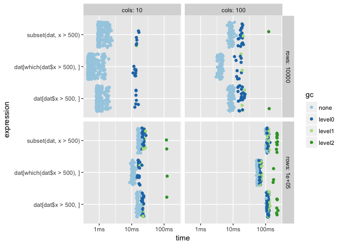

<!-- README.md is generated from README.Rmd. Please edit that file -->

# bench

[](https://travis-ci.org/jimhester/bench)

The goal of bench is to benchmark code.

## Installation

You can install the development version from
[GitHub](https://github.com/) with:

``` r
# install.packages("devtools")
devtools::install_github("jimhester/bench")
```

## Example

This is a basic example which shows you how to solve a common problem:

``` r
set.seed(42)
dat <- data.frame(x = runif(10000, 1, 1000), y=runif(10000, 1, 1000))

# Throws an error if the results are not equivalent, so you don't accidentally
# benchmark against the wrong answer
results <- bench::mark(
  y = dat[dat$x > 500, ],
  x = dat[which(dat$x > 499), ],
  subset(dat, x > 500))
#> Error: All results must equal the first result:
#>   `dat[dat$x > 500, ]` does not equal `dat[which(dat$x > 499), ]`

results <- bench::mark(
  dat[dat$x > 500, ],
  dat[which(dat$x > 500), ],
  subset(dat, x > 500))

results
#> # A tibble: 3 x 12
#>   name                      relative     n    mean     min  median    max `n/sec` allocated_memory memory result timing
#>   <chr>                        <dbl> <int>   <dbl>   <dbl>   <dbl>  <dbl>   <dbl> <chr>            <list> <list> <list>
#> 1 dat[which(dat$x > 500), ]     1.50  1154 4.31e-4 2.54e-4 2.85e-4 0.0252   2321. 366.06 kB        <Rpro… <data… <dbl …
#> 2 dat[dat$x > 500, ]            1.25   963 5.16e-4 3.22e-4 3.76e-4 0.0228   1938. 426.10 kB        <Rpro… <data… <dbl …
#> 3 subset(dat, x > 500)          1.00   768 6.48e-4 4.01e-4 4.51e-4 0.0197   1543. 546.22 kB        <Rpro… <data… <dbl …
```

``` r
set.seed(42)
results <- bench::mark(
  setup = {
    dat <- data.frame(x = runif(num_x, 1, 1000), y=runif(num_y, 1, 1000))
  },
  parameters = list(num_x = 10 ^ seq(3, 5), num_y = c(1000, 10000)),

  dat[dat$x > 500, ],
  dat[which(dat$x > 500), ],
  subset(dat, x > 500)
)
#>     num_x  num_y
#> 1   1000.  1000.
#> 2  10000.  1000.
#> 3 100000.  1000.
#> 4   1000. 10000.
#> 5  10000. 10000.
#> 6 100000. 10000.
```

``` r
library(tidyverse)
results %>%
  mutate(name = fct_reorder(name, relative)) %>%
  select(name, num_x, num_y, timing) %>%
  unnest() %>%
  ggplot(aes(x = name, y = timing)) +
    geom_jitter() +
    scale_y_log10() +
    coord_flip() +
    facet_grid(num_y ~ num_x, labeller = label_both)
```


